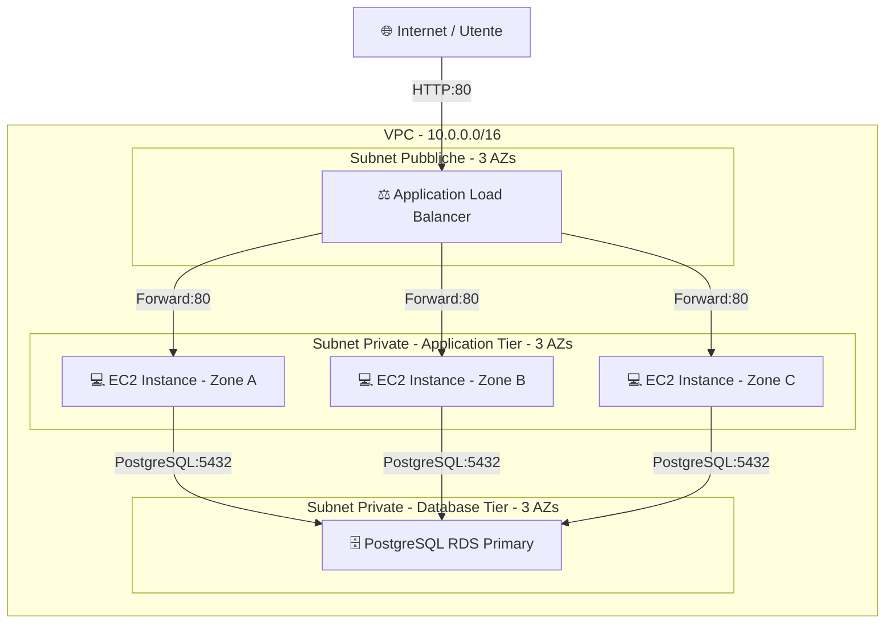

# 🚀 Production-Ready 3-Tier AWS Architecture (Terraform)

Infrastruttura Cloud resiliente, scalabile e ad alta disponibilità distribuita su AWS utilizzando **Terraform (Infrastructure as Code)**. 

L'architettura segue il pattern classico a **3 livelli (3-Tier)** per garantire la massima sicurezza e la separazione dei compiti (Separation of Concerns).

---

## 📐 Architettura di Rete e Sicurezza



---

## 🛠️ Stack Tecnologico & Componenti AWS

* **Infrastructure as Code:** Terraform
* **Networking & Load Balancing:** AWS VPC, Internet Gateway, Application Load Balancer (ALB), Public & Private Subnets distribuite su 3 Availability Zones.
* **Compute Tier:** Istanze EC2 distribuite su 3 zone di disponibilità e gestite dietro Application Load Balancer.
* **Database Tier:** Amazon RDS (PostgreSQL) posizionato in subnet private isolate non accessibili dall'esterno.
* **Security:** Security Groups concatenati a cascata (Least Privilege Principle) per consentire solo il traffico strettamente necessario tra i vari livelli.

---

## 🚀 Deployment

1. **Inizializza il provider e i moduli:**
   ```bash
   terraform init
   ```

2. **Verifica il piano di esecuzione:**
   ```bash
   terraform plan
   ```

3. **Applica l'infrastruttura su AWS:**
   ```bash
   terraform apply --auto-approve
   ```

4. **Distruggi le risorse al termine:**
   ```bash
   terraform destroy --auto-approve
   ```